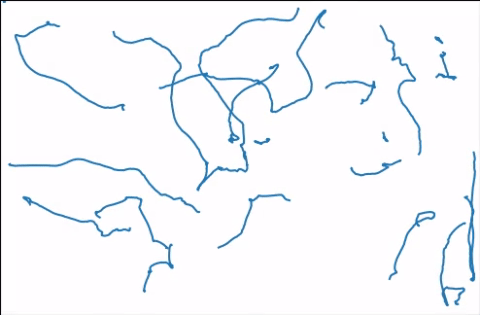
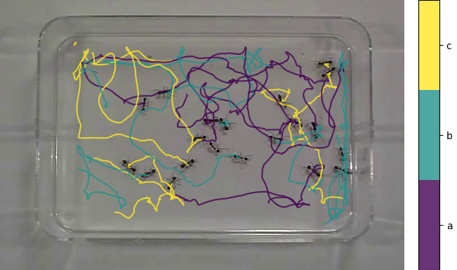
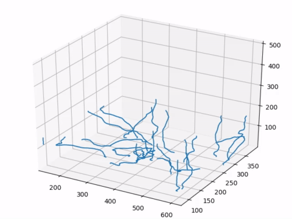
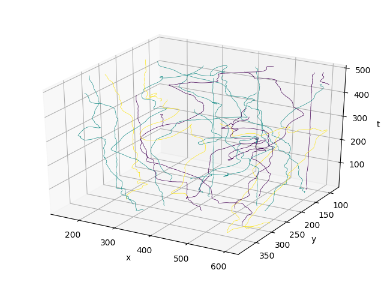

# Trackviz
Trackviz is a Python library for visualizing trajectories in 2d/3d.

## Installation
#### Conda
With [conda](https://conda.io/docs/index.html) installed, run
```
conda install -c conda-forge -c mauricemarx trackviz
```

#### Source
If you plan to edit the code, you can install manually.
```
git clone https://github.com/marximus/trackviz
cd trackviz
pip install -e .
```

## Examples
#### 2D
##### Animation

##### Static


#### 3D
##### Animation

##### Static



## Acknowledgements
Data used in examples comes from [here](http://www.eecs.qmul.ac.uk/~andrea/thdt.html).

## License
MIT License
